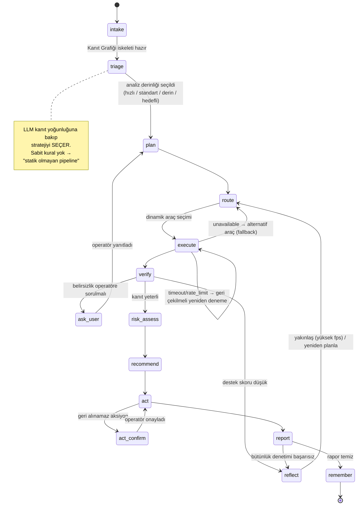
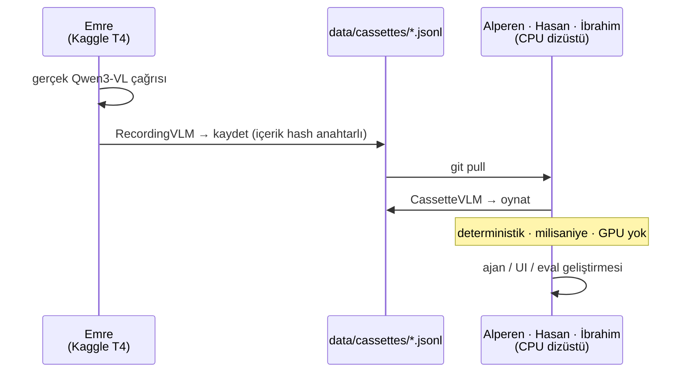

# GÖZCÜ — Sistem Mimarisi

> **GÖZCÜ** — *Görüntü Tabanlı Operasyonel Zekâ ve Karar Ünitesi*
> TEKNOFEST 2026 · Yapay Zekâ Dil Ajanları Yarışması · 3. Senaryo

---

## 1. Tasarım Tezi

Şartnamenin Bölüm 7 değerlendirme kriterleri bir **diyalog ajanı** rubriğidir:

| Rubrik ifadesi (birebir) | Ağırlık |
|---|---|
| "Mock fonksiyonların **ajanın araçları** olarak başarıyla kullanılması" | %35 içinde |
| "agent, tools, memory, prompt engineering etkin kullanımı" | %35 içinde |
| "**dinamik araç seçimi, bağlam yönetimi, çok adımlı karar zincirleri, hata işleme**" | %35 içinde |
| "Diyalog sırasında **inisiyatif alma ve doğru soruları sorma**" | %20 içinde |
| "Diyalogun **doğal ve insansı** bir akışta ilerlemesi" | %20 içinde |

Bu yüzden GÖZCÜ **"video → JSON" bir pipeline değil**, operatörle Türkçe konuşan,
araç kullanan, çok adımlı akıl yürüten bir **ajandır**. Video, ajanın *kanıt kaynağıdır*.

İkinci tasarım tezi şartnameden birebir gelir:

> "Sistem, düşük seviyeli algı (object detection vb.) ile yüksek seviyeli çıkarım
> (olay yorumlama) arasında bir **köprü** kurabilmelidir."

Bu köprü mimaride adı konmuş bir bileşendir: **Kanıt Grafiği (Evidence Graph)**.

---

## 2. Katman Diyagramı

```mermaid
flowchart TB
    subgraph L0["L0 · ALIM & UYARLANABİLİR ÖRNEKLEME"]
        A1[demux / decode<br/>PyAV] --> A2[sahne kesiti<br/>PySceneDetect]
        A2 --> A3[hareket + ses<br/>enerji haritası]
        A3 --> A4[bütçe farkındalıklı<br/>anahtar-kare seçimi]
    end

    subgraph L1["L1 · DETERMİNİSTİK ALGI (ajan araçları)"]
        B1[tespit + takip<br/>RT-DETRv2 + ByteTrack]
        B2[poz / düşme<br/>RTMPose]
        B3[bölge · KKD · kalabalık]
        B4[ASR TR<br/>faster-whisper]
        B5[ses olayı<br/>BEATs/AST]
    end

    subgraph L2["L2 · ★ KANIT GRAFİĞİ — algı ↔ anlam köprüsü"]
        C1[(zaman damgalı olgular<br/>+ izler + ilişkiler<br/>+ güven skorları)]
    end

    subgraph L3["L3 · ANLAMSAL KAVRAYIŞ (VLM @ vLLM)"]
        D1[segment analizi] --> D2[hiyerarşik özetleme<br/>segment→sahne→video]
        D2 --> D3[kaba→ince<br/>zamansal temellendirme]
    end

    subgraph L4["L4 · ★ AJAN ÇEKİRDEĞİ (LangGraph)"]
        E1[planner] --> E2[tool router]
        E2 --> E3[executor]
        E3 --> E4[verifier / critic]
        E4 --> E5[replanner]
        E5 --> E6[reporter]
        E7[(4 katmanlı bellek<br/>+ SOP RAG)]
    end

    subgraph L5["L5 · KARAR & AKSİYON"]
        F1[model tabanlı<br/>risk akıl yürütme]
        F2[emniyet bariyeri<br/>yalnızca alt sınır]
        F3[SOP'a dayalı<br/>aksiyon planı]
        F4[mock kurumsal araçlar<br/>+ hata enjeksiyonu]
        F5{{insan onayı · HITL}}
    end

    subgraph L6["L6 · YÜZEYLER"]
        G1[şartname JSON]
        G2[REST + SSE<br/>canlı ajan izi]
        G3[Operatör Konsolu]
        G4[CLI]
    end

    subgraph L7["L7 · DEĞERLENDİRME"]
        H1[KPI harness · ablation<br/>kaos testi · yük testi]
    end

    L0 --> L1 --> C1
    C1 <--> L3
    C1 <--> L4
    L3 <--> L4
    L4 --> L5 --> L6
    L4 -.trace.-> L7
    E7 -.-> E1

    style C1 fill:#2d4a63,stroke:#5b9bd5,stroke-width:3px,color:#fff
    style L4 fill:#3d2d4a,stroke:#a56bd5,stroke-width:3px
    style L2 fill:#1e3a4f,stroke:#5b9bd5,stroke-width:2px
```



---

## 3. Ajan Grafiği (LangGraph)



### Düğüm sorumlulukları

| Düğüm | Görev | Karşıladığı rubrik maddesi |
|---|---|---|
| `intake` | Video kaydı, ucuz ön geçiş (L0+L1) | Fonksiyonellik |
| `triage` | LLM analiz stratejisini seçer | "bağlama göre farklı çıktı" |
| `plan` | Hedef için araç planı | Çok adımlı karar zinciri |
| `route` | **Dinamik araç seçimi** | Birebir rubrik maddesi |
| `execute` | Paralel çağrı; timeout, retry, circuit breaker | **Hata işleme** |
| `verify` | VLM iddialarını Kanıt Grafiği'ne karşı doğrular | Açıklanabilirlik |
| `reflect` | Boşluk varsa yakınlaş / yeniden planla | Reasoning |
| `ask_user` | **Netleştirici soru sorar** | "inisiyatif alma, doğru soruları sorma" |
| `risk_assess` | Model tabanlı risk + emniyet bariyeri | Karar destek |
| `recommend` | SOP'a dayalı aksiyon planı | Karar destek |
| `act` | Mock araç yürütme + HITL onayı | Mock entegrasyon |
| `report` | Guided-JSON + Türkçe anlatı | Yapılandırılmış çıktı |
| `remember` | Epizodik belleğe yazar | Memory |

---

## 4. Bellek — 4 Katman

| Katman | İçerik | Teknoloji | Neden |
|---|---|---|---|
| **Çalışma** | Aktif videonun Kanıt Grafiği | SQLite + in-proc index | LLM bağlamını şişirmeden sorgulanabilir olgular |
| **Kısa vadeli** | Diyalog durumu, aktif plan, araç sonuçları | LangGraph checkpointer | Bağlam yönetimi, geri alma, yeniden başlatma |
| **Epizodik** | Geçmiş olaylar (videolar arası) | Chroma + BGE-M3 | "Bu bölgede bu ay 3. forklift olayı" → önleyici öneri |
| **Semantik** | SOP / İSG prosedürleri | RAG: BGE-M3 + bge-reranker-v2-m3 | Aksiyonlar prosedüre dayanır, uydurulmaz |

**Bağlam yönetimi stratejisi:**
kanıtı bağlama dökmek yerine araçla sorgula · diyalogda kayan pencere + yuvarlanan özet ·
vLLM prefix caching (sabit video bağlamı tüm turlarda yeniden kullanılır) ·
**bağlam değişimi dedektörü** (konu/video değişince durumu snapshot'la, "önceki videoya dön" desteklensin).

---

## 5. Halüsinasyon Savunması — 4 Kat

Bu senaryonun en büyük teknik riski, VLM'in olmayan bir kaza uydurmasıdır.

```mermaid
flowchart LR
    V[VLM iddiası] --> K1{1· evidence[]<br/>dolu mu?}
    K1 -->|hayır| RED[reddedilir]
    K1 -->|evet| K2{2· deterministik<br/>kaynak destekliyor mu?}
    K2 -->|hayır| K3{3· support_score<br/>eşiğin üstünde mi?}
    K2 -->|evet| GEC[rapora girer]
    K3 -->|hayır| BEL[belirsiz işaretlenir<br/>aksiyon üretilmez]
    K3 -->|evet| GEC
    GEC --> K4{4· integrity_issues<br/>boş mu?}
    K4 -->|hayır| REF[reflect düğümüne dön]
    K4 -->|evet| YAY[operatöre sunulur]

    style RED fill:#5c2a2a,color:#fff
    style BEL fill:#5c4a2a,color:#fff
    style YAY fill:#2a5c3a,color:#fff
```

1. **Kanıt zorunluluğu** — `evidence[]` boş olan olay rapora giremez
   (`AnalysisReport.integrity_issues()`).
2. **Deterministik destek** — yalnızca VLM kaynaklı iddia, yüksek `support_score`
   olmadan geçemez (`DetectedEvent.has_deterministic_support`).
3. **Aksiyon kilidi** — desteklenmeyen olay için aksiyon üretilmez.
4. **Çekimserlik bir özelliktir** — `abstentions[]` alanı, sistemin *neyi
   bilmediğini* açıkça söyler. Olaysız videoda doğru cevap "kritik olay tespit
   edilmedi"dir.

---

## 6. Veri Sözleşmesi

Şartnamenin dört anahtarı **birebir** korunur; zenginleştirme üzerine eklenir.
`events` ve `actions` **türetilmiş alanlardır** (`computed_field`) — tek doğruluk
kaynağı `events_detail` / `actions_detail`, böylece ikisi asla ayrışamaz.

```jsonc
{
  // ── ŞARTNAME SÖZLEŞMESİ (Bölüm 5, birebir) ─────────────
  "summary": "Videoda forklift kazası ve yaralanma riski gözlenmiştir.",
  "events":  [{"time": "00:15", "event": "Forklift devrildi"}],
  "risk":    "Yüksek",
  "actions": ["Sağlık ekibini çağır", "Alanı güvenlik altına al"],

  // ── GÖZCÜ ZENGİNLEŞTİRMESİ ─────────────────────────────
  "events_detail":   [ /* kanıt, güven, faz, aktörler, support_score */ ],
  "risk_assessment": { /* faktörler, gerekçe, belirsizlik, bariyer izi */ },
  "actions_detail":  [ /* öncelik, sorumlu, SOP atfı, araç, durum */ ],
  "abstentions":     [ /* bilerek karar verilmeyen noktalar */ ],
  "open_questions":  [ /* ajanın operatöre soracakları */ ],
  "metrics":         { /* rtf, gecikme, token, VRAM, cache */ }
}
```

**Garanti zinciri:** Pydantic v2 → JSON Schema → vLLM `guided_json` (xgrammar) →
şema doğrulama → gerekirse onarım turu.
KPI hedefi: **Geçerli JSON Oranı = 1.00**.
Sözleşme `tests/contracts/test_sartname_contract.py` ile kilitlidir.

---

## 7. Donanım Profilleri

Tek kod tabanı, üç ortam (`config/profiles/*.yaml`):

| Profil | Nerede | VLM | Algı | Amaç |
|---|---|---|---|---|
| `cpu-dev` | Herkesin dizüstü | **Kaset replay** | ONNX CPU | Dört kişinin **GPU'suz tam hızda** çalışması |
| `colab-t4` | Kaggle 2×T4 (ücretsiz) | Qwen3-VL-8B-AWQ, `dtype: half` | ONNX GPU | Gerçek doğrulama + **kaset üretimi** |
| `h200-prod` | Yarışma donanımı | Qwen3-VL-32B FP8 + Qwen3-8B planner | TensorRT | Final KPI sayıları |

### Kaset (record/replay) mekanizması — projenin kilit mühendislik kararı



GPU darboğazı dört kişiyi değil bir kişiyi bağlar. Kaset anahtarı isteğin **içerik
hash'idir** (`VLMRequest.cache_key()`), dolayısıyla dosya yolları gibi ortama bağlı
alanlar anahtarı etkilemez — kaset her makinede tutar.

---

## 8. Modül Sahipliği

| Katman | Paket | Sahibi |
|---|---|---|
| L0–L2 Algı & Kanıt | `ingest/`, `perception/`, `evidence/` | **Hasan** |
| L3 + Servisleme + Perf | `understanding/`, `serving/` | **Emre** |
| L4 Ajan Çekirdeği | `agent/` | **Alperen** |
| L5–L6 Karar & Ürün | `decision/`, `mocks/`, `api/`, `ui/` | **İbrahim** |
| Sözleşmeler | `contracts/` | **Ortak** — değişim ADR + 4 onay gerektirir |
| L7 Değerlendirme | `eval/` | **Dönüşümlü Eval Kaptanı** |

### Dondurulmuş sınırlar (paralel çalışmayı mümkün kılan dört arayüz)

| # | Sınır | Üreten → Tüketen |
|---|---|---|
| 1 | `EvidenceQuery` / `EvidenceQueryResult` | Hasan → Alperen |
| 2 | `VLMClient` protokolü + kaset formatı | Emre → Alperen, İbrahim |
| 3 | `Tool` protokolü + `ToolSpec` / `ToolResult` | Alperen → İbrahim, Hasan, Emre |
| 4 | `AnalysisReport` + SSE olay formatı | Alperen → İbrahim |

Bu dördü değişmediği sürece kimse kimseyi beklemez.
`python tasks.py schema-check` sessiz kırılmaları yakalar.

---

## 9. Kaynaklar

- Şartname: `2026_TEKNOFEST_TYDA_SARTNAME_Ucuncu_Senaryo_TR_2_NoDue.pdf`
- Karar kayıtları: [`docs/decisions/`](decisions/)
- Lisans hijyeni: [`docs/licenses.md`](licenses.md)
- Değerlendirme/KPI: [`docs/evaluation.md`](evaluation.md)
- Haftalık ilerleme: [`docs/weekly/`](weekly/)
